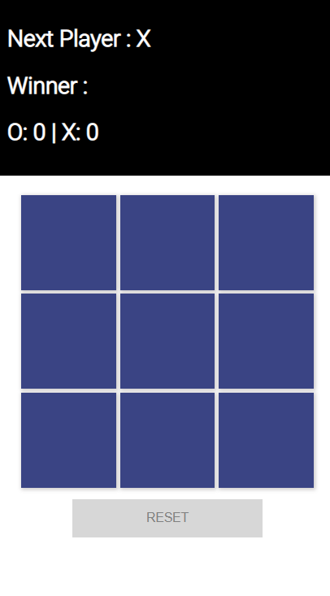

# HashGame

This project was generated with [Angular CLI](https://github.com/angular/angular-cli) version 10.0.4.

## Available Scripts

In the project directory, you can run:

### `npm i`

The first command is npm i to install packages from NPM.

## Development server

Run `ng serve` for a dev server. Navigate to `http://localhost:4200/`. The app will automatically reload if you change any of the source files.

## Go to the GAME
[Play](https://fredmpeixoto.github.io/hash-game/).

